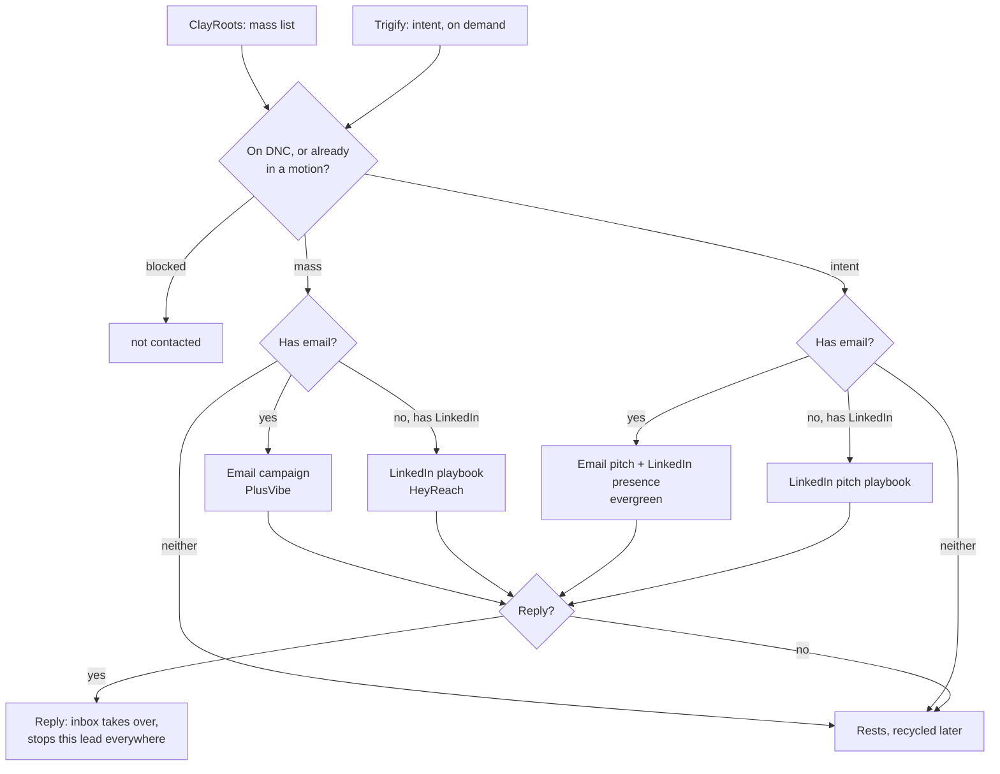

# Sequencing

How a lead moves from entry to first reply.

## The pieces

- **Sources:** ClayRoots (mass lists, some with email, some LinkedIn only) and Trigify (intent, pulled on demand).
- **Senders:** PlusVibe for email, HeyReach for LinkedIn.
- **Campaigns:** batch email campaigns, one standing evergreen intent-email campaign, and LinkedIn playbooks (pitch and presence).

## The rules

1. **Route once, at entry.** A lead's channel is decided when it enters and does not change, unless a later contact pull finds an email it was missing.
2. **One pitch per lead.** An intent lead is pitched by email and merely present on LinkedIn (view, like, connect), never pitched on both.
3. **Email just runs; LinkedIn waits at acceptance.** Not accepted, with no email, means that lead's outreach is over.
4. **A reply stops the lead everywhere.** On any channel, both tools, at once. The inbox owns them from there.
5. **A positive reply or a booked meeting freezes the whole domain**, on both channels, not just the one contact.
6. **On DNC, never contacted. Ends quiet, the lead rests** and is recycled later with a fresh angle.

## What varies per client

See the client's Overrides: whether LinkedIn runs at all, which sequencer, which scheduler, and the DNC seed.
